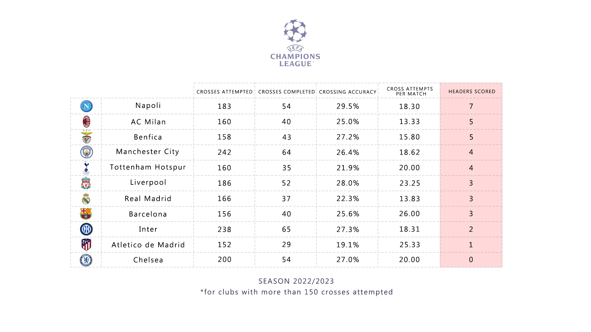

<strong>ABOUT</strong> 
 
This repo covers crosses and headers scored for 2023 UEFA Champions League for clubs that attempted more than 150 crosses in total. All data from official UEFA stats page that you can find at https://www.uefa.com/uefachampionsleague/

<strong>WHY COVER THIS AREA OF THE GAME?</strong> 
 
High crosses in football(soccer) generally have a low conversion rate but are still considered important part of the game. This repo attempts to show how successful are the best European clubs in converting crosses into goals. 

<strong>WHAT HAS THE TABLE COVERED?</strong> 
 
1. Crosses attempted
2. Crosses completed
3. Crossing accuracy
4. Cross attempts per match
5. Headers scored

<strong>SCREENSHOTS</strong>
